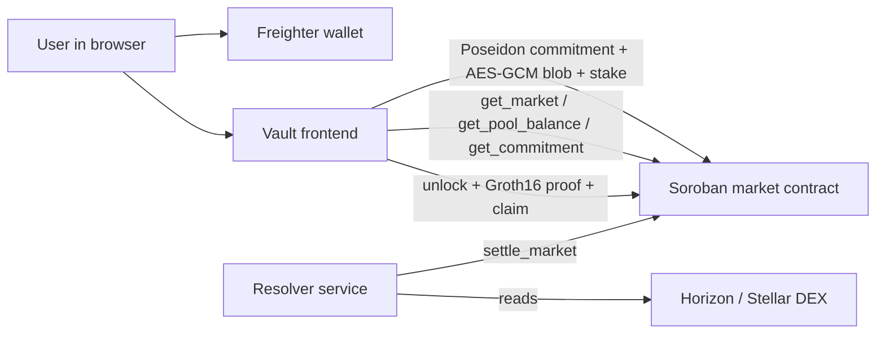

# Vault

**Private range prediction markets on Stellar.**

Instead of betting yes/no, you predict a **numeric range**. The tighter your range, the higher your multiplier. Your prediction stays cryptographically **sealed** until settlement — then you prove on-chain that it was right, without ever revealing it early.

---

## Project Overview

Vault is a range-based prediction market built on **Stellar/Soroban** and secured by **zero-knowledge proofs**.

Traditional prediction markets are binary — yes or no. Vault lets you stake on a _range_ of outcomes and rewards precision: a narrower correct range pays a larger multiplier. This only works if predictions are private, because a visible tight range would be copied instantly. Vault seals each prediction as a **Poseidon commitment** at stake time and uses a **Groth16 (BN254)** proof at claim time to demonstrate — without disclosure — that your sealed range matched your stake and that the settled value fell inside it.

Zero-knowledge is not a bolt-on privacy feature here; it is the mechanism that makes the precision-multiplier market possible at all.

## Features

- **Range predictions with a precision multiplier** — tighter correct ranges earn more (`floor(max_width / width) − 1`, capped per market).
- **Sealed commitments** — predictions are stored on-chain as Poseidon hashes; nobody can see your range before settlement.
- **Client-side ZK proofs** — Groth16 proofs are generated in the browser with snarkjs; nothing sensitive leaves the device.
- **Freighter-derived encryption** — the full prediction blob is AES-GCM encrypted with a key derived (HKDF) from a Freighter signature.
- **On-chain stake custody & pooled payouts** — stakes transfer to the Soroban contract; winners are paid from the pool with a 2% fee.
- **Duplicate-claim protection** — per-wallet nullifier prevents double claims.
- **Live oracle settlement** — an authenticated resolver settles markets from public Stellar Horizon / SDEX data.
- **Nine seeded testnet markets** — Stellar-metric markets (payments, XLM/USDC, network volume) plus crypto price markets (BTC/ETH/SOL/XLM/DOGE/HYPE).

## Architecture



| Layer                          | Responsibility                                                                                  |
| ------------------------------ | ----------------------------------------------------------------------------------------------- |
| **Frontend** (React/Vite)      | Range entry, wallet connection, encryption, in-browser proof generation, claim UX, live polling |
| **Freighter**                  | Wallet authorization, transaction signing, encryption-message signing                           |
| **Soroban contract** (Rust)    | Market state, stake custody, settlement, payout math, nullifier checks                          |
| **Resolver service** (Express) | Reads public Stellar data and posts settlement to the contract (auth-gated)                     |
| **Horizon / SDEX**             | Source data for the Stellar-metric markets                                                      |

**Prediction → claim flow**

1. UI reads market state from the contract.
2. User picks a range + stake.
3. Browser generates a Poseidon commitment and AES-GCM-encrypts the prediction blob (key from a Freighter signature).
4. `commit_prediction` stores the commitment + blob and transfers the stake to the pool.
5. Resolver posts the settled value via `settle_market` from public Stellar data.
6. User unlocks the blob locally and generates a Groth16 proof in the browser.
7. `claim_winnings` validates commitment, range containment, settlement state, and the nullifier, then pays out.

## Installation

**Prerequisites**

- Node.js 22+
- Rust + `wasm32v1-none` target (`rustup target add wasm32v1-none`) — only needed to rebuild the contract
- [Stellar CLI](https://developers.stellar.org/docs/tools/cli) 25+ — only needed to deploy
- A [Freighter](https://www.freighter.app/) wallet on Stellar **testnet**

```bash
git clone <your-fork-url> vault
cd vault
npm install
cp .env.example .env   # then fill in the values (see Environment Variables)
```

## Local Development

```bash
npm run dev          # Vite dev server (frontend)
npm run build        # production build: tsc -b && vite build
npm run preview      # preview the production build
npm test             # unit tests (node --test)
npm run typecheck:server
npm run start:server # run the resolver service locally (tsx)
```

Run a resolver against a market:

```bash
npm run resolve:xlm-payments -- --market-id=3011 --max-pages=1
npm run resolve:xlm-usdc
npm run resolve:crypto-price
```

Seed / fund markets on-chain (uses `VAULT_ADMIN_SECRET`):

```bash
npx tsx scripts/create-crypto-markets.ts
```

## Deployment

**Smart contract (Stellar testnet)** — the contract is already deployed (see below). To deploy your own:

```bash
# build
cd contracts/vault_market
RUST_MIN_STACK=536870912 cargo build --target wasm32v1-none --release
stellar contract build --optimize   # or: stellar contract optimize --wasm <path>

# fund a deployer identity
stellar keys generate vault-deployer --network testnet --fund

# deploy with the constructor (admin, native XLM SAC)
stellar contract deploy \
  --wasm target/wasm32v1-none/release/vault_market.optimized.wasm \
  --source vault-deployer --network testnet \
  -- --admin <ADMIN_G...> \
     --xlm_token $(stellar contract id asset --asset native --network testnet)

# regenerate the TypeScript bindings for the new contract id
stellar contract bindings typescript --network testnet \
  --contract-id <NEW_CONTRACT_ID> \
  --output-dir src/generated/vault-market --overwrite
```

> Note: Rust 1.82+ requires the `wasm32v1-none` target (not `wasm32-unknown-unknown`). On Windows, set `RUST_MIN_STACK` high (e.g. 512 MB) to avoid rustc stack overflows while compiling the proc-macro dependencies.

**Frontend** — any static host. Build with `npm run build` and serve `dist/`. A `vercel.json` rewrite is included for the `/markets/*` routes.

**Resolver service** — deployable to Railway/Nixpacks (`railway.json`, `nixpacks.toml` included); start command `npm run start:server`. Settlement endpoints require the `RESOLVER_ADMIN_TOKEN` bearer; the resolver secret stays server-side and is never exposed to the browser.

```text
GET  /health
POST /resolve/xlm-payments
POST /resolve/xlm-usdc
POST /resolve/crypto-price
```

## Smart Contracts

**`vault_market`** (`contracts/vault_market/src/lib.rs`) — Soroban contract. Constructor: `__constructor(admin, xlm_token)`.

| Function                                               | Purpose                                                                                              |
| ------------------------------------------------------ | ---------------------------------------------------------------------------------------------------- |
| `create_market`                                        | Admin creates a market (range width, multiplier cap, min stake, resolution time, treasury, resolver) |
| `commit_prediction` / `commit`                         | Store a Poseidon commitment + encrypted blob and transfer the stake into the pool                    |
| `fund_pool`                                            | Add XLM liquidity to a market pool                                                                   |
| `settle_market`                                        | Resolver posts the settled actual value                                                              |
| `claim_winnings` / `claim`                             | Validate commitment, range, settlement, nullifier → pay net winnings                                 |
| `get_market` / `get_market_stats` / `get_pool_balance` | Read market state                                                                                    |
| `get_commitment` / `get_claim`                         | Read a wallet's commitment / claim                                                                   |
| `is_nullifier_used`                                    | Duplicate-claim check                                                                                |

**Payout math**

```text
width       = high - low
multiplier  = clamp( floor(max_range_width / width) - 1 , 1 , max_multiplier )
gross       = stake * multiplier
net_payout  = gross - gross * 2%
```

Losing stakes remain in the pool and fund future winning payouts.

**ZK circuit** (`circuits/range_market.circom`) — Circom 2.1.6 + snarkjs Groth16 (BN254).
Commitment: `Poseidon(low, high, salt, market_id)`. Private inputs: `predicted_low, predicted_high, salt`. Public inputs: `commitment, actual_value, market_id, multiplier_tier`. The circuit proves commitment correctness and range containment without revealing the range. Proving artifacts live in `public/proofs/`.

> On-chain Groth16 verification via Stellar's BN254 host functions (CAP-0074/0075) is the production upgrade path; the contract and circuit are structured for it. Today the contract enforces all state transitions (commitment storage, settlement, payout, nullifier), while proof generation and verification run client-side. See `scripts/verifier-smoke-test.ts`.

### Live deployment (Stellar testnet)

| Item                        | Value                                                                                                                         |
| --------------------------- | ----------------------------------------------------------------------------------------------------------------------------- |
| Contract ID                 | `CAWSR2X6Z3ZDCS34OTPHY3WHSWO7BMU56GQR427UZ2CP7Q6ZANJ4RMDX`                                                                    |
| WASM hash                   | `6f39822e3839fef9c70427a311b23380ed734428869af787a66e596326909622`                                                            |
| Admin / Treasury / Resolver | `GBVMM2SUURDY4QEZVCRVYKMZ3OZ6ORAGNRA27PFI5NVMKTWCNYHY2RDR`                                                                    |
| XLM token (native SAC)      | `CDLZFC3SYJYDZT7K67VZ75HPJVIEUVNIXF47ZG2FB2RMQQVU2HHGCYSC`                                                                    |
| Markets created             | `3003`, `3004`, `3011` (Stellar-metric) · `3005`–`3010` (crypto price)                                                        |
| Pool liquidity              | ~50 XLM funded per market (~450 XLM total)                                                                                    |
| Crypto market resolution    | 2026-12-31 00:00 UTC                                                                                                          |
| Explorer                    | [stellar.expert →](https://stellar.expert/explorer/testnet/contract/CAWSR2X6Z3ZDCS34OTPHY3WHSWO7BMU56GQR427UZ2CP7Q6ZANJ4RMDX) |

## Environment Variables

Copy `.env.example` to `.env`. `VITE_*` values are public (bundled into the browser app); everything else is server-side only. **Never** prefix a secret with `VITE_`.

| Variable                        | Scope          | Description                                                    |
| ------------------------------- | -------------- | -------------------------------------------------------------- |
| `VITE_CONTRACT_ID`              | frontend       | Vault market contract id used by the app                       |
| `VITE_VAULT_MARKET_CONTRACT_ID` | frontend       | Explicit market contract id (falls back to `VITE_CONTRACT_ID`) |
| `VITE_TREASURY_ADDRESS`         | frontend       | Treasury address shown in the UI                               |
| `STELLAR_NETWORK`               | server         | `testnet` / `mainnet`                                          |
| `STELLAR_RPC`                   | server         | Soroban RPC URL                                                |
| `HORIZON_URL`                   | server         | Horizon URL for testnet reads                                  |
| `SDEX_HORIZON_URL`              | server         | Horizon URL for mainnet SDEX price reads                       |
| `RESOLVER_SECRET`               | server         | Stellar secret key that signs settlement txs (keep private)    |
| `RESOLVER_ADMIN_TOKEN`          | server         | Bearer token guarding settlement endpoints                     |
| `VAULT_MARKET_CONTRACT_ID`      | server/scripts | Market contract id for resolver + scripts                      |
| `VAULT_MARKET_ID`               | server         | Default XLM-payments market id (`3003`)                        |
| `VAULT_XLM_USDC_MARKET_ID`      | server         | XLM/USDC market id (`3004`)                                    |
| `VAULT_ADMIN_ADDRESS`           | scripts        | Market admin address                                           |
| `VAULT_RESOLVER_ADDRESS`        | scripts        | Resolver address stored on new markets                         |
| `VAULT_TREASURY_ADDRESS`        | scripts        | Treasury address stored on new markets                         |
| `VAULT_FUNDER_ADDRESS`          | scripts        | Address used to fund market pools                              |
| `XLM_TOKEN_CONTRACT_ID`         | server/scripts | Native XLM Stellar Asset Contract id                           |
| `PORT`                          | server         | Resolver service port (default `3000`)                         |

Additional script-only vars: `VAULT_ADMIN_SECRET` (deployer/admin secret for `create-crypto-markets`), `VAULT_CRYPTO_MARKET_POOL_XLM` (pool size per crypto market).

## Tech Stack

- **Frontend:** React 19, Vite 6, TypeScript 5, Tailwind CSS 4, shadcn/ui + Radix UI, lucide-react, GSAP, sonner
- **Blockchain:** Stellar / Soroban, `soroban-sdk` 25 (Rust), `@stellar/stellar-sdk` 15, Freighter wallet
- **Zero-knowledge:** Circom 2.1.6, snarkjs (Groth16 / BN254), circomlib / circomlibjs (Poseidon)
- **Backend:** Express 5 resolver service, run with `tsx`; deployable via Railway / Nixpacks
- **Tooling:** Stellar CLI, `node --test`, Vercel (frontend hosting)

---

_Testnet project. Stakes use testnet XLM and have no real-world value._
