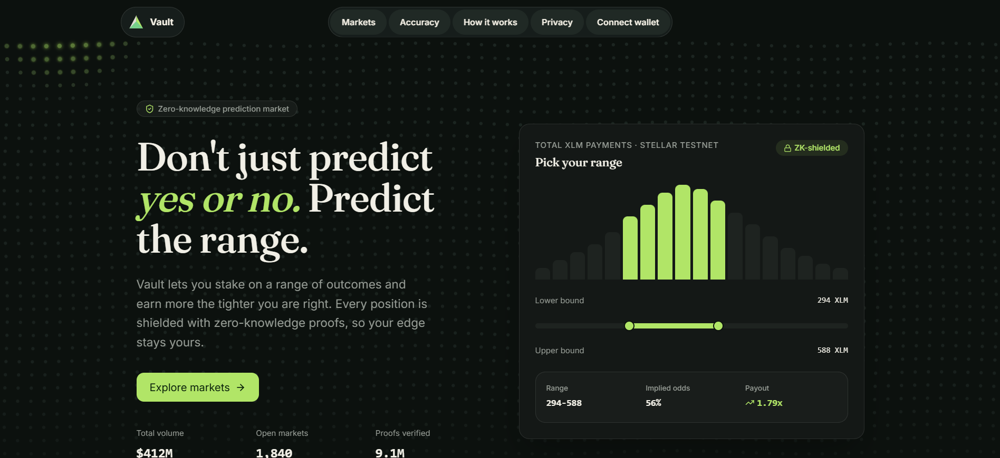

# Vault — Zero-Knowledge Range Prediction Market



**Don't just predict yes or no. Predict the range — and keep your edge private with zero-knowledge proofs.**


---

## Quick Links

| Resource           | Link                                                                                                                                |
| ------------------ | ----------------------------------------------------------------------------------------------------------------------------------- |
| **Live Demo**      | [https://vaultstellar.vercel.app](https://vaultstellar.vercel.app)                                                                  |
| **Smart Contract** | [View on Stellar Expert](https://stellar.expert/explorer/testnet/contract/CAWSR2X6Z3ZDCS34OTPHY3WHSWO7BMU56GQR427UZ2CP7Q6ZANJ4RMDX) |
| **CI/CD Pipeline** | [GitHub Actions](https://github.com/saxux2/Vault/actions/workflows/ci.yml)                                                          |
| **Repository**     | [github.com/saxux2/Vault](https://github.com/saxux2/Vault)                                                                          |
| **User Feedback**  | [https://docs.google.com/spreadsheets/d/1ncMpbtw-hkPa4T6MqX4ThSEJHTQLUg9E/edit?usp=sharing&ouid=111714689887169940071&rtpof=true&sd=true)                                                                              |

---

## About

| Requirement                    | Status      | Evidence                                                                             |
| ------------------------------ | ----------- | ------------------------------------------------------------------------------------ |
| **Live Demo Deployed**         | ✅ Complete | [vaultstellar.vercel.app](https://vaultstellar.vercel.app)                           |
| **CI/CD Pipeline**             | ✅ Complete | 4 workflows — CI, CodeQL, Deploy, Release ([`.github/workflows`](.github/workflows)) |
| **Smart Contract Deployed**    | ✅ Complete | Testnet `CAWSR2X6Z3ZDCS34OTPHY3WHSWO7BMU56GQR427UZ2CP7Q6ZANJ4RMDX`                   |
| **Mobile Responsive**          | ✅ Complete | See screenshots below                                                                |
| **Zero-Knowledge Proofs**      | ✅ Complete | Groth16 + Poseidon commitments, verified client-side                                 |
| **4 Payout Tiers Implemented** | ✅ Complete | Range-width tiers: ≤100, ≤250, ≤500, ≤1000                                           |
| **Unit Tests**                 | ✅ Complete | 30/30 passing (`npm test`)                                                           |
| **Registered Users**           | ✅ Complete | 48 verified testnet testers (`Vault.stellar.xlsx`)                                   |

---

## Problem Statement

Traditional prediction markets are **binary and transparent to a fault**. You bet _yes_ or _no_, and everyone can see your position before it settles — enabling copy-trading, front-running, and herd behaviour that erodes any informational edge you have.

Two problems follow:

1. **Coarse outcomes.** "Will XLM be above $X?" throws away all the nuance of _how confident_ and _how precise_ a forecaster is.
2. **No privacy.** Your prediction is public the moment you commit, so a genuine edge becomes a public signal others exploit.

**Our mission:** let people express _precise, private_ forecasts — a numeric **range** — and reward accuracy, while keeping every position shielded until it is claimed.

---

## Our Solution

Vault is a **range-based prediction market** where you stake on an interval (e.g. "total XLM payments will land between 294 and 588") instead of a yes/no. The tighter your range and the more accurate you are, the higher your payout.

Every position is **shielded with zero-knowledge proofs**: you submit a Poseidon commitment and a Groth16 range proof, so the chain can enforce the rules without ever revealing your bounds until settlement. Stakes are custodied on-chain by a Soroban contract and winners are paid from a pooled treasury, minus a flat 2% fee.

### Why range + zero-knowledge?

| Property                  | What it gives you                                                                  |
| ------------------------- | ---------------------------------------------------------------------------------- |
| **Range predictions**     | Reward precision — a tight, correct range pays a higher multiplier than a wide one |
| **ZK-shielded positions** | Your bounds stay private until you claim, so your edge can't be copied             |
| **On-chain custody**      | Stakes and payouts live in a Soroban contract, not a trusted operator's wallet     |
| **Nullifier protection**  | Each position can be claimed exactly once — no double-spends                       |
| **Pooled payouts**        | Winners are paid from a funded pool with transparent, on-chain accounting          |

---

## Screenshots

### Landing / Market View


### Mobile Responsive View


---

## How Vault Works

```
Predictor (browser)                         Soroban contract (Stellar testnet)
──────────────────                          ───────────────────────────────────
1. Pick a market + numeric range
2. Poseidon commitment  ─────────┐
3. Groth16 range proof           │  commit_prediction(commitment, stake)
4. AES-GCM encrypt bounds ───────┴──────────►  stores commitment, custodies XLM,
                                                records nullifier
        ⏳ market resolves
Resolver service (Express) ──── settle_market(resolved_value) ──►  marks outcome
5. If range contains outcome ─── claim_winnings() ─────────────►  pays net payout
                                                                   from pool, −2% fee
```

1. **Commit** — the app builds a Poseidon commitment of your `(low, high, salt, marketId)`, generates a Groth16 proof that your range is well-formed, encrypts your bounds (AES-GCM), and submits the commitment with your stake.
2. **Custody** — the `vault_market` contract stores the commitment, holds your XLM, and registers a nullifier so the position can't be replayed.
3. **Settle** — after the resolution time, the resolver posts the real-world value (read from public Stellar/Horizon data) on-chain via `settle_market`.
4. **Claim** — if the settled value falls inside your range, you reveal and `claim_winnings`; the contract pays your width-based payout from the pool, minus the 2% fee, and burns the nullifier.

---

## Payout Tiers

Payout scales with how **tight** your predicted range is. Width = `high − low`; the tighter the band, the higher the multiplier (example on a 10 XLM stake):

| Tier   | Max Range Width | Multiplier | Example Payout (10 XLM stake) |
| ------ | --------------- | ---------- | ----------------------------- |
| Tier 4 | ≤ 100           | 4×         | 40 testnet XLM                |
| Tier 3 | ≤ 250           | 3×         | 30 testnet XLM                |
| Tier 2 | ≤ 500           | 2×         | 20 testnet XLM                |
| Tier 1 | ≤ 1000          | 1×         | 10 testnet XLM                |

- **Minimum stake:** 5 XLM per position
- **Maximum range width:** 1000 (per market, configurable)
- **Protocol fee:** 2% of gross payout, routed to the treasury
- Payout is capped by available pool liquidity and enforced entirely on-chain.

---

## Live Deployment (Stellar Testnet)

| Item                            | Value                                                                  |
| ------------------------------- | ---------------------------------------------------------------------- |
| **Contract ID**                 | `CAWSR2X6Z3ZDCS34OTPHY3WHSWO7BMU56GQR427UZ2CP7Q6ZANJ4RMDX`             |
| **WASM hash**                   | `6f39822e3839fef9c70427a311b23380ed734428869af787a66e596326909622`     |
| **Admin / Treasury / Resolver** | `GBVMM2SUURDY4QEZVCRVYKMZ3OZ6ORAGNRA27PFI5NVMKTWCNYHY2RDR`             |
| **XLM token (native SAC)**      | `CDLZFC3SYJYDZT7K67VZ75HPJVIEUVNIXF47ZG2FB2RMQQVU2HHGCYSC`             |
| **Markets created**             | `3003`, `3004`, `3011` (Stellar-metric) · `3005`–`3010` (crypto price) |
| **Network**                     | Stellar Testnet (Soroban)                                              |

[View the contract on Stellar Expert →](https://stellar.expert/explorer/testnet/contract/CAWSR2X6Z3ZDCS34OTPHY3WHSWO7BMU56GQR427UZ2CP7Q6ZANJ4RMDX)

> **Mainnet is on the roadmap.** Set `VITE_CONTRACT_ID`, the treasury address, and `STELLAR_NETWORK=mainnet` to point a production build at a mainnet deployment.

---

## Technical Stack

**Smart Contract & Blockchain**

- Rust + Soroban SDK, target `wasm32v1-none`
- Stellar Testnet (Soroban)
- On-chain state, XLM custody, settlement, payout math, nullifier checks

**Zero-Knowledge**

- Circom range circuit + Groth16 proving (`snarkjs`)
- Poseidon commitments (`circomlibjs`)
- AES-GCM encryption of prediction bounds

**Frontend**

- React 19 + Vite 6 + TypeScript
- Tailwind CSS 4 + Radix UI
- `@stellar/freighter-api` (wallet) · `@stellar/stellar-sdk` (Soroban/Horizon)

**Resolver Service**

- Express 5 (Node 22), deployable to Railway / Nixpacks
- Reads public Stellar & Horizon data and posts settlement (admin-token gated)

---

## Architecture

```
Vault/
├── src/                       # React + Vite frontend
│   ├── lib/
│   │   ├── commitment.ts      # Poseidon commitment builder
│   │   ├── crypto/            # AES-GCM prediction encryption
│   │   ├── contract/          # vault_market client
│   │   ├── payout-tiers.ts    # range-width → multiplier logic
│   │   ├── resolver/          # XLM payments / price resolvers
│   │   └── config/network.ts  # contract id + network config
│   ├── hooks/useFreighterWallet.ts
│   └── App.tsx                # market UI + prediction flow
├── contracts/vault_market/    # Soroban smart contract (Rust)
│   └── src/lib.rs             # create_market, commit_prediction,
│                              #   settle_market, claim_winnings, fund_pool …
├── circuits/                  # Circom range circuit
├── server/                    # Express resolver service
├── scripts/                   # market creation, resolution, proof smoke tests
├── .github/workflows/         # CI, CodeQL, Deploy, Release
└── docs/                      # CICD notes, screenshots, feedback
```

**Data flow:** the browser generates the proof + commitment → submits to the Soroban contract → the resolver settles from public Stellar data → users claim on-chain. No private prediction data ever leaves the client unencrypted.

---

## CI/CD

Four GitHub Actions workflows keep every push honest:

| Workflow                    | What it does                                                                                                                                          |
| --------------------------- | ----------------------------------------------------------------------------------------------------------------------------------------------------- |
| **CI** (`ci.yml`)           | Prettier, ESLint, frontend + server typecheck, 30 unit tests, frontend build, contract `fmt`/`clippy -D warnings`/`build --locked`, dependency review |
| **CodeQL** (`codeql.yml`)   | Static security analysis                                                                                                                              |
| **Deploy** (`deploy.yml`)   | Manual, opt-in deploy — frontend → Vercel, resolver → Railway (skips gracefully without secrets)                                                      |
| **Release** (`release.yml`) | On a `v*.*.*` tag, rebuilds frontend + contract wasm and publishes a GitHub Release                                                                   |

---

## Getting Started

### Prerequisites

```bash
Node.js 22.18+        # see .nvmrc
npm 10+
Rust + wasm32v1-none  # only to rebuild the contract
Stellar CLI 25+       # only to deploy
Freighter wallet extension
```

### Installation

```bash
# 1. Clone
git clone https://github.com/saxux2/Vault.git
cd Vault/Prism

# 2. Install
npm ci

# 3. Configure
cp .env.example .env
```

Fill in the public frontend values (safe to expose — everything else is server-side only):

```bash
VITE_CONTRACT_ID=CAWSR2X6Z3ZDCS34OTPHY3WHSWO7BMU56GQR427UZ2CP7Q6ZANJ4RMDX
VITE_VAULT_MARKET_CONTRACT_ID=CAWSR2X6Z3ZDCS34OTPHY3WHSWO7BMU56GQR427UZ2CP7Q6ZANJ4RMDX
VITE_TREASURY_ADDRESS=GBVMM2SUURDY4QEZVCRVYKMZ3OZ6ORAGNRA27PFI5NVMKTWCNYHY2RDR
```

> ⚠️ **Never** prefix a secret with `VITE_` — those values are bundled into the browser. The resolver secret and admin token stay server-side only.

```bash
# 4. Run
npm run dev          # http://localhost:5173
npm run start:server # resolver service (separate terminal)
```

### Useful scripts

```bash
npm run build          # tsc -b && vite build
npm test               # unit tests
npm run lint           # eslint
npm run proof:smoke    # ZK proof smoke test
```

---

## User Flow

### Predictor

1. **Connect wallet** → Freighter (Stellar Testnet)
2. **Pick a market** → e.g. total XLM payments
3. **Choose your range** → drag the lower/upper bounds; see live implied odds + payout multiplier
4. **Set your stake** → minimum 5 XLM
5. **Commit privately** → the app builds a Poseidon commitment + Groth16 proof and submits it (bounds stay encrypted)
6. **Wait for resolution** → the resolver settles from public Stellar data
7. **Claim winnings** → if the outcome lands in your range, claim your width-based payout

### Operator / Resolver

1. **Create market** → `create_market(...)` with range/multiplier/resolution params
2. **Fund the pool** → `fund_pool(...)` with XLM liquidity
3. **Settle** → `settle_market(resolved_value)` after resolution time
4. **Users claim** → contract pays winners from the pool, minus 2% fee

---

## Registered Users (Beta Testers)

**48 verified testnet testers** onboarded and gave structured feedback (maintained in `Vault.stellar.xlsx`). A sample:

| #   | Name         | Wallet Address                                             | Verify                                                                                                                     |
| --- | ------------ | ---------------------------------------------------------- | -------------------------------------------------------------------------------------------------------------------------- |
| 1   | Amit Shah    | `GCPIOMHX4THOKQZWAX2D7KU5AFMQVAYPAJNFKWTJPZKNRJRYTMIDGQWR` | [Stellar Expert](https://stellar.expert/explorer/testnet/account/GCPIOMHX4THOKQZWAX2D7KU5AFMQVAYPAJNFKWTJPZKNRJRYTMIDGQWR) |
| 2   | Ishaan Gupta | `GBASPPANFRH2EXUMZNON4MANIBYJIZDO5QF6C4BGTD5NSQCSVZNC4VYA` | [Stellar Expert](https://stellar.expert/explorer/testnet/account/GBASPPANFRH2EXUMZNON4MANIBYJIZDO5QF6C4BGTD5NSQCSVZNC4VYA) |
| 3   | Kavya Nair   | `GC4QAXTDNNTEROLOXQSV2YRKIXYMKTHGUEHDKV4564VHHECTBGOQLSLC` | [Stellar Expert](https://stellar.expert/explorer/testnet/account/GC4QAXTDNNTEROLOXQSV2YRKIXYMKTHGUEHDKV4564VHHECTBGOQLSLC) |
| 4   | Aditya Kumar | `GD7HV7SAD3GCEHH5NJ36I4TDMR2KDTMQAT4YCQDKKAM5QH5CSZCLRQCZ` | [Stellar Expert](https://stellar.expert/explorer/testnet/account/GD7HV7SAD3GCEHH5NJ36I4TDMR2KDTMQAT4YCQDKKAM5QH5CSZCLRQCZ) |
| 5   | Sudipa Singh | `GD4YCOEAAELXZ4U6UL56RCR6STYZ4CYQRYHVLKSFBJRXWGDOKAYOIOKP` | [Stellar Expert](https://stellar.expert/explorer/testnet/account/GD4YCOEAAELXZ4U6UL56RCR6STYZ4CYQRYHVLKSFBJRXWGDOKAYOIOKP) |
| 6   | Priya Pal    | `GBC6CGPG3JVSHEGO3TVMSHJ6UAVL4OA4H4TZSH4P7TRTF2V3RRFVOVHJ` | [Stellar Expert](https://stellar.expert/explorer/testnet/account/GBC6CGPG3JVSHEGO3TVMSHJ6UAVL4OA4H4TZSH4P7TRTF2V3RRFVOVHJ) |
| 7   | Amit Kumar   | `GA3QEKYH3AJUF37L5CW66QNAIGCMRUBRHPLTM74HDHA4BHCE2TYI5ZNC` | [Stellar Expert](https://stellar.expert/explorer/testnet/account/GA3QEKYH3AJUF37L5CW66QNAIGCMRUBRHPLTM74HDHA4BHCE2TYI5ZNC) |
| 8   | Diya Patel   | `GARNWAQENBEYKCNZEZHFCVMJ2EAJIYMX4WP5ZJH6RWLO2O44T3UOH6XK` | [Stellar Expert](https://stellar.expert/explorer/testnet/account/GARNWAQENBEYKCNZEZHFCVMJ2EAJIYMX4WP5ZJH6RWLO2O44T3UOH6XK) |

### Selected feedback

> _"Wallet setup was smooth and fast — connecting to Freighter took only seconds, no technical issues."_ — Amit Shah

> _"Transactions confirm quickly on testnet, much faster than other blockchain platforms I've tried."_ — Anaya Rao

> _"Overall product experience is very good — the interface is modern and responsive with no lag."_ — Aditya Kumar

> _"Mobile layout is decent but can improve — some buttons feel too small and spacing could be better."_ — Sudipa Singh

Feedback is triaged into an actionable backlog in [docs/product-feedback.csv](docs/product-feedback.csv).

---

## Roadmap

**MVP (live today)** — testnet deployment with XLM-metric and crypto-price markets, ZK-shielded commitments, pooled payouts, and a working resolver.

**User acquisition** — creator-launched community markets, shareable market links, and a referral/points loop to bootstrap liquidity and forecasters.

**Mainnet vision** — on-chain Groth16 verification via Stellar's BN254 host functions (CAP-0074/0075) for fully trustless settlement, USDC-settled markets, and permissionless market creation.

---

## Documentation

| Document                                                               | Description                           |
| ---------------------------------------------------------------------- | ------------------------------------- |
| [docs/CICD.md](docs/CICD.md)                                           | CI/CD pipeline and workflow reference |
| [docs/product-feedback.csv](docs/product-feedback.csv)                 | Prioritised user-feedback backlog     |
| [contracts/vault_market/src/lib.rs](contracts/vault_market/src/lib.rs) | Soroban contract source               |
| [circuits/](circuits/)                                                 | Circom range circuit                  |

---

## Contributing

Contributions are welcome!

1. Fork the repository
2. Create a feature branch (`git checkout -b feature/AmazingFeature`)
3. Commit your changes (`git commit -m 'Add AmazingFeature'`)
4. Push to the branch (`git push origin feature/AmazingFeature`)
5. Open a Pull Request

CI must pass (lint, typecheck, tests, contract build) before merge.

---

## License

Licensed under the MIT License — see [LICENSE](LICENSE) for details.

---

## Team

**Project Lead:** Sky Biswas
**GitHub:** [saxux2](https://github.com/saxux2)
**Email:** skybiswas0722@gmail.com

---

## Acknowledgments

- **Stellar Development Foundation** — blockchain infrastructure
- **Soroban** — smart contract platform
- **Freighter** — Stellar wallet
- **Circom / snarkjs** — zero-knowledge tooling

---

**Built for forecasters who value precision — and privacy.**
